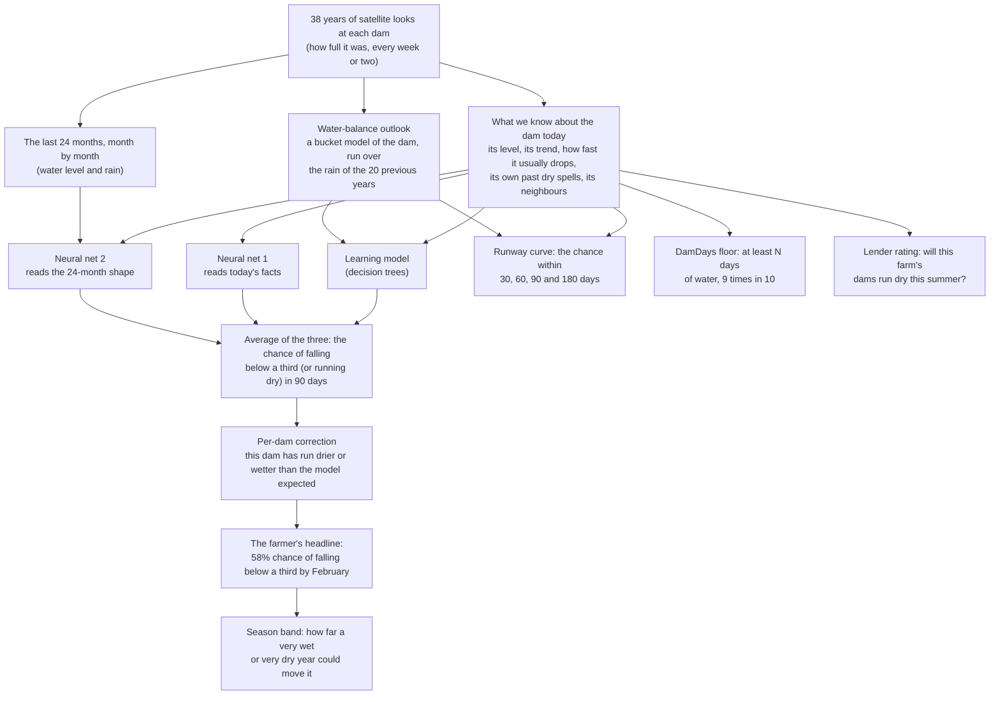

# How DamDays works

This page is for anyone who wants to know what DamDays does without reading code or statistics. Every number on it comes from the validation years (2009 to 2015): years the model never learned from. The full tables, with every check, are [`artifacts/ladder_val.md`](../artifacts/ladder_val.md) (the four pre-registered versions of the model, side by side) and [`artifacts/val_tidemark_best.md`](../artifacts/val_tidemark_best.md) (the full scorecard of the fullest version that passes the pre-registered check).

## The two questions

- **A farmer asks:** "Will my dam fall below a third of full in the next three months? How many days of water do I have, at the least?"
- **A lender asks:** "Which farms in my book will see their dams run dry this summer?"

Satellites have photographed every farm dam in Australia every week or two since 1986. Geoscience Australia turns each photo into "how much of this dam is wet today". DamDays reads 38 years of that history for each dam and answers both questions.

## The picture

The engine is called Tidemark. All of it is reached through one file, [`damdays/models/tidemark.py`](../damdays/models/tidemark.py): `fit_tidemark` learns, `predict_tidemark` forecasts.

## How we score a forecast

Two plain ideas, used everywhere below.

- **Skill score.** Take a simple rule, such as "in this region in January, 24% of dams fall below a third within 90 days". Count how wrong it is over thousands of forecasts. The skill score is the share of those mistakes the model removes. **0.18 means 18% fewer mistakes than the simple rule**; 0 means no better.
- **Ranking accuracy.** Pick one dam that did fall below a third and one that did not. How often did the model give the first one the higher chance? **0.5 is a coin toss; 1.0 is perfect.**

A tougher simple rule is "this dam's own track record" ("this dam fell below a third after 30% of its past forecasts"). Beating that shows the model knows more than "some dams dry out more often".

**Ranges.** Each headline number comes with a 95% range, found by re-drawing the dams at random 500 times and scoring again. If the range sits above zero, the result is unlikely to be luck.

## The parts, and what each one adds

All numbers are for dams that behave like farm dams, forecasts made from October to March (when dams run down), on the validation years. In brackets: the part of the code that does it. "Adds" is always measured on exactly the same forecasts, with and without the part.

| part | what it does, in plain words | what it adds on the validation years |
|---|---|---|
| **Simple rules to beat** ([baselines](../damdays/models/baselines.py)) | "This month, this region, X% of dams fall below a third." And "this dam's own track record". | The dam's own record already removes 8% of the simple rule's mistakes. Today's level alone removes 1%. |
| **What we know today** ([features](../damdays/features/spec.py)) | 29 facts about each dam on the day of the forecast: how full it is, how fast it has been dropping, how fast it usually drops in summer, when it was last full or last low, its own past dry spells, and how the dams around it are doing. Each fact uses only what was known that day. | (the inputs to everything below) |
| **The learning model** (a decision-tree model, [fusion](../damdays/models/fusion.py)) | Learns from 1988 to 2008 how those 29 facts lead to a dam falling below a third (or running dry) within 90 days. On its own, this is the pre-registered benchmark (G2). | Skill **0.17** against the simple rule, and 10% fewer mistakes than the dam's own record. Ranking accuracy **0.78** (below a third) and **0.83** (fully dry). This is where most of the skill lives. |
| **Per-dam correction** ([frailty](../damdays/models/frailty.py)) | Some dams run drier than dams that look like them (a leaky floor, heavy stock use). It looks at the dam's own past forecasts, but only those whose answer was already known (90 days later, plus 30 days to confirm), and nudges the next forecast up or down. It also gives the app a plain label: "runs drier than similar dams" or "runs wetter". | A small gain: **0.2%** of the simple rule's mistakes (range 0.02% to 0.36% for "below a third"; for "fully dry" the range just touches zero), and 0.3% on dams that rarely dry out. |
| **Consistency rule** ([fusion](../damdays/models/fusion.py)) | A dam that is fully dry is also below a third, so the chance of "below a third" is never shown lower than the chance of "fully dry". | Logically required, and pre-registered. It costs a hair of skill on these years (0.06%), because it raised forecasts in the wet 2010-12 years that were already a little high. |
| **Two small neural nets** ([nets](../damdays/models/nets.py)) | Two more forecasters, averaged with the learning model in equal thirds. One reads the **shape of the last 24 complete months**, month by month: the water level, whether the dam was seen, its dry looks, and the rain ([sequences](../damdays/features/sequences.py)). The other reads today's facts plus the recent rain. Each net is trained 3 times from different random starting points and the 3 are averaged, because a single training run is noisy. Like everything else, they learn only from answers known before the cutoff. | The biggest add-on: **0.9%** of the simple rule's mistakes for "below a third" (range 0.5% to 1.2%), **1.5%** for "fully dry" and **1.9%** for gradual dry-outs. On dams that rarely dry out the gain is larger (1.3% to 2.4%). |
| **Water-balance outlook** ([physics](../damdays/models/physics.py)) | A simple bucket model of each dam: rain flows in, evaporation and stock use take water out. One set of numbers for all dams, refitted each year from the satellite looks, and kept on track by each new look. Run forward over the rain of the same months in each of the 20 previous years, it gives two numbers: the share of those 20 futures in which the dam falls below a third, or runs dry, within 90 days. They are two extra inputs to the learning model and the runway curve. | Small. For "fully dry" and gradual dry-outs it removes a further **0.2%** of the mistakes (range 0.1% to 0.3%, clearly above zero). For "below a third" it adds **0.03%**, with a range from -0.02% to +0.09%: **not clearly above zero**. On its own it ranks dams weakly (0.65 below a third, 0.71 fully dry): a way to explain a forecast ("under past rain years, this dam ran dry in 7 of 20") more than a forecaster. |
| **Runway curve** ([hazard](../damdays/models/hazard.py)) | One model gives the chance within 30, 60, 90 and 180 days. It is built so the chance can never go down as the days go up. In the full version it also reads the two water-balance numbers. | Skill **0.10, 0.15, 0.17 and 0.20** at 30, 60, 90 and 180 days (each against its own simple rule). The curve never went down, on any of the 358,525 "below a third" and 461,839 "fully dry" curves. The water balance helps the "fully dry" curve at every horizon (0.5% to 0.9%), and the "below a third" curve only at 30 and 60 days. |
| **DamDays floor** ([uncertainty](../damdays/models/uncertainty.py)) | "At least N days of water above a third, 9 times in 10." A model of the shortest likely runway, checked so that the promise holds about 90% of the time. | The floor held for **90.0%** of 304,611 forecasts (range 89.7% to 90.3%; target 90%). The typical floor was 45 days. |
| **Season band** ([uncertainty](../damdays/models/uncertainty.py)) | Some years are wetter or drier than any model expects. The band shows how far the forecast moved in the most extreme years of an earlier test (2002 to 2008, run with this same recipe). In the full version a forecast of 30% reads "13% to 48%". | In the full version it held in **15 of 16** region-years (one region in one July-June year) for "below a third", and in 13 of 16 for "fully dry" and for gradual dry-outs (the version without nets and water balance: 15, 15 and 14 of 16). Every miss is a very wet La Nina year, wetter than any year in the band: central-west NSW in 2011-12, and for the fully-dry bands also western Victoria in 2010-11 and 2011-12. |
| **Lender rating** ([season_rating](../damdays/models/season_rating.py)) | Each 1 July, the chance that the dams in each 2 km area all run dry before the end of March. It starts from each dam's own dry-season record and corrects it with the dam's state on 1 July and its neighbours. No rainfall goes in. | Ranking accuracy **0.79**, against **0.54** for a rainfall-only score (what drought tools use today) and 0.63 for the best rainfall-only model we could build. Within a single season (which farms, this year) it is 0.79 against 0.47 for rainfall. |

## Four versions, and a rule written in advance to choose between them

The pre-registration ([PREREG.md](../PREREG.md), "Fallback ladder") lists four versions, from simplest to fullest. Each was scored on these same years in the earlier research, before the event. The rule: **the frozen model is the fullest version whose rebuild at the event scores within 0.006 of its earlier score** (for "below a third" and "fully dry"), **and passes the look-ahead test**. So a part only ships if the event rebuild does what the research version did, without peeking.

| version | what it adds | below a third: skill now (earlier research) | fully dry: skill now (earlier research) | passes the rule? |
|---|---|---|---|---|
| L0, the benchmark G2 | the learning model alone | 0.170 (0.171) | 0.175 (0.176) | yes |
| L1 | + per-dam correction and consistency rule | 0.171 (0.173) | 0.177 (0.177) | yes |
| L2 | + the two neural nets | 0.180 (0.181) | 0.192 (0.192) | yes |
| L3, full Tidemark | + the water-balance outlook | 0.180 (0.182) | 0.194 (0.195) | yes |

All four rebuild within 0.006 of their earlier scores (the largest gap is 0.0015), and the look-ahead test passes for every input each one uses, so all four pass, and the fullest, L3 (full Tidemark), is the highest version that passes. [`scripts/12_ladder_val.py`](../scripts/12_ladder_val.py) fits all four through the same two calls and writes the table ([`artifacts/ladder_val.md`](../artifacts/ladder_val.md)). The choice itself is recorded separately, in a dated note added to the pre-registration before the sealed region is opened.

**The full version against the pre-registered bars** ([PREREG.md](../PREREG.md)): at least 10% fewer mistakes than the simple rule, at least 5% fewer than the dam's own record, and a sensible spread of chances. On the validation years the full version removes **18%** of the simple rule's mistakes (range 16.5% to 19.7%) and 11% of the dam's own record's, and its spread is 1.06 where 1.0 is ideal: it clears all three. The lender rating clears its bar too: it must beat the rainfall-only score's ranking accuracy by at least 0.05; it beats it by 0.25 (range 0.23 to 0.27).

**Against the benchmark.** The full version beats the benchmark G2, on exactly the same forecasts, by **1.0%** of the simple rule's mistakes for "below a third" (range 0.7% to 1.4%), **1.9%** for "fully dry" (range 1.4% to 2.3%) and **2.2%** for gradual dry-outs (range 1.7% to 2.8%). Most of that comes from the two neural nets. The earlier research found 1.1%, 1.9% and 2.2%. Without the nets and the water balance (version L1) the gain is only 0.14% (range -0.04% to +0.30%).

## How we keep it honest

- **No peeking.** Every fact the model uses on a given day was known on that day. A test deletes every satellite look after a cut date, rebuilds everything (the 29 facts, the per-dam correction, the nets' 24-month sequences and the water balance), and checks that every earlier input is identical to the last decimal ([`tests/test_no_lookahead.py`](../tests/test_no_lookahead.py)). It also plants deliberate leaks (a column that reads the next look, a per-dam correction that counts answers before they are final, a water balance that reads this month's rain before the month is over, a 24-month window that includes the current month) and checks that each one is caught.
- **Learn on the past, judge on the future.** The model learned only from forecasts whose answer was known before 2009, and is judged on 2009 to 2015. Every design choice was made on these years.
- **One look at the test years.** 2016 to 2026 is scored once per model, and a ledger refuses a second look with changed forecasts ([docs/SCORECARD.md](SCORECARD.md)).
- **A sealed region.** A third region (Southern Downs, Granite Belt, New England) was downloaded before the event but never opened. It is opened once, on camera, after the model is frozen.
- **The same scorecard for everyone.** Tidemark, the benchmark and the simple rules all go through one piece of scoring code, on exactly the same forecasts.
- **Matches the earlier research.** Every count matches the pre-event research exactly, and every version's skill score is within the tolerance set in advance (0.006).

## What it does not do

- **It ranks farms better than it times droughts.** It is good at "which dams run dry this summer", and weak at "will this dam run dry this year or next" (ranking accuracy about 0.52 within a single dam's own history, close to a coin toss). A rainfall-only score does better at that second question (0.61), though it is still weak, and it is no better than a coin toss at the first (0.47).
- **Very wet or very dry years.** In the wet 2010-12 years the forecasts were too high on average. That is what the season band is for; the forecasts are not quietly adjusted. With the nets the forecasts are also a little too cautious (spread 1.06 to 1.14, where 1.0 is ideal and above 1 means the chances should be further apart).
- **Most of the skill is in the first learning model.** The nets add about one point of skill and the water balance a fraction of one. For "below a third" the water balance's gain is not clearly above zero; it is in the full version because the pre-registered recipe includes it, and because "under past rain years" helps explain a forecast.
- **The headline and the runway curve come from different models.** The 90-day headline averages the learning model and the two nets; the runway curve is its own model (with the water balance, without the nets). For "below a third" their 90-day values differ by 4.5 percentage points on average, and by more than 11 points for 1 forecast in 10. The app shows both.
- **Small dams are invisible.** The satellite needs a dam outline of at least 6 pixels (about 5,400 m2), so the smallest farm dams are not covered.
