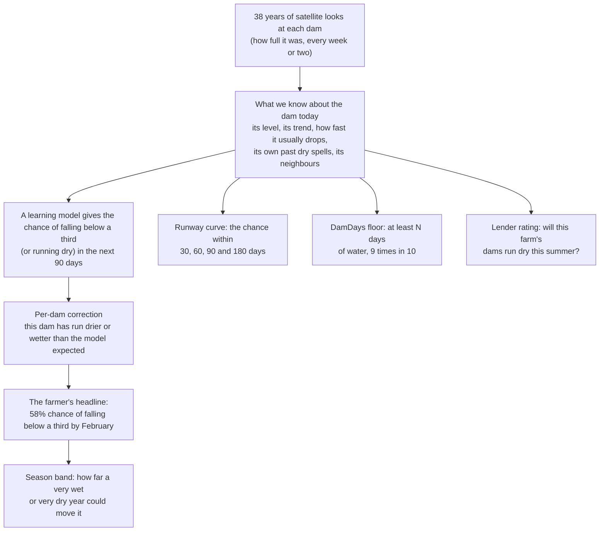

# How DamDays works

This page is for anyone who wants to know what DamDays does without reading code or statistics. Every number on it comes from the validation years (2009 to 2015): years the model never learned from. The full table, with every check, is [`artifacts/val_tidemark_L1.md`](../artifacts/val_tidemark_L1.md).

## The two questions

- **A farmer asks:** "Will my dam fall below a third of full in the next three months? How many days of water do I have, at the least?"
- **A lender asks:** "Which farms in my book will see their dams run dry this summer?"

Satellites have photographed every farm dam in Australia every week or two since 1986. Geoscience Australia turns each photo into "how much of this dam is wet today". DamDays reads 38 years of that history for each dam and answers both questions.

## The picture

The engine is called Tidemark. All of it is in one file, [`damdays/models/tidemark.py`](../damdays/models/tidemark.py).

## How we score a forecast

Two plain ideas, used everywhere below.

- **Skill score.** Take a simple rule, such as "in this region in January, 24% of dams fall below a third within 90 days". Count how wrong it is over thousands of forecasts. The skill score is the share of those mistakes the model removes. **0.17 means 17% fewer mistakes than the simple rule**; 0 means no better.
- **Ranking accuracy.** Pick one dam that did fall below a third and one that did not. How often did the model give the first one the higher chance? **0.5 is a coin toss; 1.0 is perfect.**

A tougher simple rule is "this dam's own track record" ("this dam fell below a third after 30% of its past forecasts"). Beating that shows the model knows more than "some dams dry out more often".

**Ranges.** Each headline number comes with a 95% range, found by re-drawing the dams at random 500 times and scoring again. If the range sits above zero, the result is unlikely to be luck.

## The parts, and what each one adds

All numbers are for dams that behave like farm dams, forecasts made from October to March (when dams run down), on the validation years. In brackets: the part of the code that does it.

| part | what it does, in plain words | what it adds on the validation years |
|---|---|---|
| **Simple rules to beat** ([baselines](../damdays/models/baselines.py)) | "This month, this region, X% of dams fall below a third." And "this dam's own track record". | The dam's own record already removes 8% of the simple rule's mistakes. Today's level alone removes 1%. |
| **What we know today** ([features](../damdays/features/spec.py)) | 29 facts about each dam on the day of the forecast: how full it is, how fast it has been dropping, how fast it usually drops in summer, when it was last full or last low, its own past dry spells, and how the dams around it are doing. Each fact uses only what was known that day. | (the inputs to everything below) |
| **The learning model** (a decision-tree model, [fusion](../damdays/models/fusion.py)) | Learns from 1988 to 2008 how those 29 facts lead to a dam falling below a third (or running dry) within 90 days. | Skill **0.17** against the simple rule, and 10% fewer mistakes than the dam's own record. Ranking accuracy **0.78** (below a third) and **0.83** (fully dry). This is where most of the skill lives. |
| **Per-dam correction** ([frailty](../damdays/models/frailty.py)) | Some dams run drier than dams that look like them (a leaky floor, heavy stock use). It looks at the dam's own past forecasts, but only those whose answer was already known (90 days later, plus 30 days to confirm), and nudges the next forecast up or down. It also gives the app a plain label: 8% of forecasts say "runs drier than similar dams", 17% "runs wetter". | A small gain: it removes a further **0.2%** of the simple rule's mistakes (range 0.02% to 0.36% for "below a third"; for "fully dry" the range just touches zero), and 0.3% on dams that rarely dry out. |
| **Consistency rule** ([fusion](../damdays/models/fusion.py)) | A dam that is fully dry is also below a third, so the chance of "below a third" is never shown lower than the chance of "fully dry". | Logically required, and pre-registered. It cost a hair of skill on these years (0.06%), because it raised forecasts in the wet 2010-12 years that were already a little high. |
| **Runway curve** ([hazard](../damdays/models/hazard.py)) | One model gives the chance within 30, 60, 90 and 180 days. It is built so the chance can never go down as the days go up. | Skill **0.10, 0.15, 0.17 and 0.20** at 30, 60, 90 and 180 days (each against its own simple rule). The curve never went down, on any of the 358,525 "below a third" and 461,839 "fully dry" curves. |
| **DamDays floor** ([uncertainty](../damdays/models/uncertainty.py)) | "At least N days of water above a third, 9 times in 10." A model of the shortest likely runway, checked so that the promise holds about 90% of the time. | The floor held for **90.0%** of 304,611 forecasts (range 89.7% to 90.3%; target 90%). The typical floor was 45 days. |
| **Season band** ([uncertainty](../damdays/models/uncertainty.py)) | Some years are wetter or drier than any model expects. The band shows how far the forecast moved in the most extreme years of an earlier test (2002 to 2008, run with this same recipe). A forecast of 30% reads "13% to 46%". | It held in **15 of 16** region-years (one region in one July-June year) for "below a third" (15 of 16 for fully dry, 14 of 16 for gradual dry-outs). The one miss for "below a third": central-west NSW in 2011-12, a very wet La Nina year, wetter than any year in the band. |
| **Lender rating** ([season_rating](../damdays/models/season_rating.py)) | Each 1 July, the chance that the dams in each 2 km area all run dry before the end of March. It starts from each dam's own dry-season record and corrects it with the dam's state on 1 July and its neighbours. No rainfall goes in. | Ranking accuracy **0.79**, against **0.54** for a rainfall-only score (what drought tools use today) and 0.63 for the best rainfall-only model we could build. Within a single season (which farms, this year) it is 0.79 against 0.47 for rainfall. |

The pre-registered bars ([PREREG.md](../PREREG.md)) for the farmer forecast are: at least 10% fewer mistakes than the simple rule, at least 5% fewer than the dam's own record, and a sensible spread of chances. The farmer forecast clears all three on the validation years: 17% fewer mistakes (range 16% to 19%), 10% fewer than the dam's own record, and a spread of 0.97 where 1.0 is ideal. The lender rating clears its bar too: it must beat the rainfall-only score's ranking accuracy by at least 0.05; it beats it by 0.25 (range 0.23 to 0.27).

**Against the benchmark.** The pre-registered benchmark (G2) is the learning model on its own. On these years Tidemark L1 beats it by only 0.14% of the mistakes (range -0.04% to +0.30%), so that gain is not yet clearly above zero. The earlier research found most of the gain over the benchmark in the two parts not built yet (see the last section).

## How we keep it honest

- **No peeking.** Every fact the model uses on a given day was known on that day. A test deletes every satellite look after a cut date, rebuilds everything, and checks that every earlier fact is identical to the last decimal ([`tests/test_no_lookahead.py`](../tests/test_no_lookahead.py)).
- **Learn on the past, judge on the future.** The model learned only from forecasts whose answer was known before 2009, and is judged on 2009 to 2015. Every design choice was made on these years.
- **One look at the test years.** 2016 to 2026 is scored once per model, and a ledger refuses a second look with changed forecasts ([docs/SCORECARD.md](SCORECARD.md)).
- **A sealed region.** A third region (Southern Downs, Granite Belt, New England) was downloaded before the event but never opened. It is opened once, on camera, after the model is frozen.
- **The same scorecard for everyone.** Tidemark, the benchmark and the simple rules all go through one piece of scoring code, on exactly the same forecasts.
- **Matches the earlier research.** Every count here matches the pre-event research exactly, and every skill score is within the tolerance set in advance (0.006).

## What it does not do

- **It ranks farms better than it times droughts.** It is good at "which dams run dry this summer", and weak at "will this dam run dry this year or next" (ranking accuracy about 0.52 within a single dam's own history, close to a coin toss). A rainfall-only score does better at that second question (0.61), though it is still weak, and it is no better than a coin toss at the first (0.47).
- **Very wet or very dry years.** In the wet 2010-12 years the forecasts were too high on average. That is what the season band is for; the forecasts are not quietly adjusted.
- **Small dams are invisible.** The satellite needs a dam outline of at least 6 pixels (about 5,400 m2), so the smallest farm dams are not covered.
- **This is rung L1 of the pre-registered plan** (the learning model plus the per-dam correction). The two extra parts planned for the full version, two neural networks that read the shape of the last two years, and a simple water-balance model, scored about one point higher in the earlier research (skill 0.18 instead of 0.17). They plug into the same file later.
